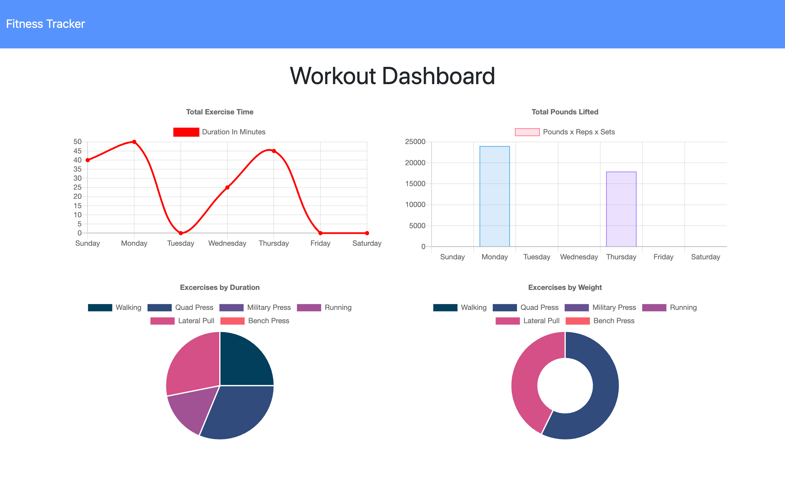

# Workout-Tracker

This web based application provides a tracking platform for users to track both cardio and resistance workouts. The UI has been provided by the client. Functionality was developed utilizing Node.js, MongoDB with Mongoose, and Express.



## User Story

```
AS someone interested in being fit and healthy,
I WANT to be able to create and track daily workouts
SO THAT I will reach my fitness goals quicker
```

## Acceptance Criteria

```
GIVEN that I want to be able to log multiple exercises in a workout on a given day
WHEN I open the application home page
THEN I am given the option to create a New Workout or Continue a Workout that I have already started

WHEN I choose a Workout Option
THEN I am redirected to a page to enter a new exercise
THEN I can choose Cardio or Resistance
THEN I can enter the name, weight, sets, reps, and duration of a Resistance exercise OR name, distance, and duration of a Cardio exercies
THEN I can choose to add another exercise or complete the workout

WHEN I want to see my progress for the current week
THEN I can navigate to my Dashboard and see workout stats
```

# Application Usage

## Node.js

Download application package and open folder in Node.js

Install node dependencies:

```
npm install
```

Install MongoDB (if you do not have it already) and start the Mongo shell - for assistance visit: https://docs.mongodb.com/manual/installation/

Start the server:

```
npm run start
```

Open a web browser and navigate to localhost:3000 to demo the application

## Web Browser

To run a demo of this application, visit:

https://be-fit-today.herokuapp.com/

# Application Development

### Known Issues

- The pie and donut charts on the stats page do not correctly parse exercises if there are multiple exercisea in a single workout

### Potential Improvements

Although this application meets the client criteria, it could be improved in the following ways:

- Provide date selection so workouts can be entered for past days
- Provide more options for stats including a variety of date ranges, a journal view of daily workouts, and more specific tracking of particular exercise stats
- Provide option to autmotically enter past exercises or create a database of exercises to choose from rather than manually entering each exercise

# Credits

All files in the Public folder were provided by:
© 2019 Trilogy Education Services, a 2U, Inc. brand. All Rights Reserved

Debugging and functionality imporvements were made to some of these files and that work can be seen in the commit history.

# License

MIT © Ingrid Hoffman
